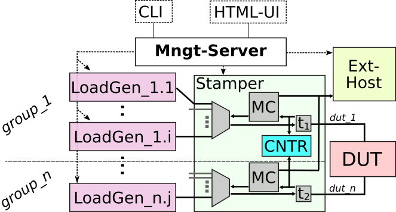

# P4STA: High Performance Packet Timestamping and Load Aggregation Framework

P4STA is an open source framework that combines the flexibility of software data traffic load generation with the accuracy of hardware timestamping. P4STA enables a measurement accuracy of a few nanoseconds and zero packet loss detection using standard programmable hardware, i.e. mainly P4-targets (but also FPGAs).
The P4STA framework consists of:
* P4STA core implementation - orchestrating the functionalities
* CLI management interface
* HTML-UI management interface (recommended - same functionality as CLI)
* Hardware abstractions for different timestamping devices (called "Stamper")
* Loadgenerator abstractions
* Evaluation scripts for measurement series

Currently supported Stamper Targets are:
* P4-bmv2 reference implementation
* Barefoot Tofino (available as subrepository) - see  [Stamper Targets](#Stamper-Targets)

Further upcoming targets are:
* Netronome NFP-SmartNICs - coming late 2019
* NetFPGA-SUME - approximately early 2020
* Intel DE10-Pro FPGAs - approximately mid 2020


**Note: This is a alpha-state prelease**
The following features are not part of the GitHub project as they are not yet fully integrated:
* DPDK-based packet capturing
* Analytics functions (P4STA-Analytics) (e.g. service curve calculations, ...)
* Load generator control abstractions (currently only iPerf3 is fully integrated)


# Publications
* "How to measure the speed of light with programmable data plane hardware?"@ 2nd P4Europe Workshop: [Demo Paper](https://www.kom.tu-darmstadt.de/research-results/publications/publications-details/?no_cache=1&pub_id=KSK19)
* "P4STA: High Performance Packet Timestamping with Programmable Packet Processors"@ IEEE/IFIP NOMS: coming soon!


# Architecture



P4STA testbeds consits of three main components:
1. **Load generation servers.** The number is $\ge 1$. Servers are arranged in n groups, each assigned to one Device Under Test (DUT)-port.
2. **Stamper device.** Connecting all load generation servers and the DUT with each other. Stamper is used for load aggregation, packet timestamping and counting packets.
3. **Device Under Test (DUT).** Object of investigation. The number of DUT-ports is equal to the number of server group ports.

Packets are generated by a load generator, timestamped (t1) by the Stamper, forwarded to the DUT, timestamped again (t2) by the stamper, and sent back to a corresponding loadgen.
These two timestamps enable latency time measurements.


## Routing
Packets, arriving at the Stamper from a load generator port, are forwarded to the DUT port which belongs to this server group.
Packets, arriving from a DUT-port, are forwarded to one server. If the forwarding mode is:
* **L1** only one server per group is allowed and all packets are forwarded to this server.
* **L2** based on the Ethernet destination address.
* **L3** based on the IPv4 destination address. (IPv6 forwarding is currently not supported)

## Timestamping
Timestamps are stored inside the packets. Either (1) in an additional TCP option field or (2) in the UDP payload.
A packet, entering the Stamper device after the DUT can be forwarded to the external host, which captures all packets including the timestamps.
A sampling "downscale" factor can be defined, which causes that only every n-th paket will be forwarded to the external host. 

## Software Components
P4STA core components are mostly based on Python. The HTML-UI is realized with Django and communication between Core and UI/CLI is based in RPyC.
Stamper implementations vary due to hardware specific constraints and P4_14, P4_16 and Verilog is used here.


# Installation
P4STA needs to be run on Linux. Ubuntu 16.04/18.04 LTS is well tested but other version should work as well.
After cloning this repository on any server/machine (management server) in your testbed, ensure that:
1. Every server (loadgen servers, P4-device, external host) requires ssh pub key from management-server to allow a password-free SSH-connection
2. Enter your SSH Usernames and IPs at the beginning of ./install.sh and ensure that it's executeable (chmod +x ./install.sh)
3. Execute the install script (./install.sh)
```
./install.sh
```
4. Compile the P4-Code from target directory to your P4-device. For BMV2 (Mininet) this is not necessary as this repository contains compiled P4-code.


## Dependencies Management Server
If you **don't** use the install.sh script ensure that the following requirements are installed at the management server. Otherwise **IGNORE THIS**.
* Python >= 3.5 with pip3 _AND_ Python 2.7 with pip at all servers
* Django >= 2.2
* matplotlib >= 3.0.3
* numpy >= 1.16.2
* rpyc >= 4.1.1
* tabulate >= 0.8.3
* setproctitle >= 1.1.10 (only if you want to use BMV2)
* iPerf3 >= 3.1.3 (only if you want to use BMV2)


Older versions may also work, but have not been verified. If you want to install the dependencies by yourself and not automatically with install.sh the packages can be installed at the Managament Server as follows:
``` 
sudo apt install python3-matplotlib
```
```
pip3 install tabulate Django numpy rpyc	
```
# Dependencies External Host
* Python 2.7 with pip
* setproctitle >= 1.1.10
<br />
Older versions may also work, but have not been verified. If you want to install the dependencies by yourself and not automatically with install.sh the packages can be installed at the Managament Server as follows:
```
pip install setproctitle
```

# Dependencies Loadgenerator Servers
The following dependencies are automatically installed with ./install.sh if Ubuntu 16.04 is used:
* iPerf3 >= 3.1.3

## Stamper Targets
P4STA supports different targets, currently P4-BMv2, Barefoot Tofino and Netronome SmartNICs.
For each target there exists a subfolder in "targets". Further targets can be easily installed by copying the corresponding driver.
Currently, part of this repository is only the BMv2 version. For access to the Netronome SmartNIC and Barefoot Tofino code please contact Ralf Kundel directly.


## BMV2 environment

The following dependencies are _not_ automatically installed with ./install.sh:
* Mininet >= 2.3.0d5. see: http://mininet.org/download/ Please use Option 2: Native Installation from Source
* bmv2 P4-behavioral model. see: https://github.com/p4lang/behavioral-model


# Using P4STA
After the installation you will be asked if you want to use the local Web-GUI or CLI. If you choose the GUI it will be accessible in your browser at http://127.0.0.1:9997 if installed on your localhost or in general on: http://management-server-ip:9997

We highly recommonend to use the "status check" after configuration / before deployment to eliminate configuration faults.

